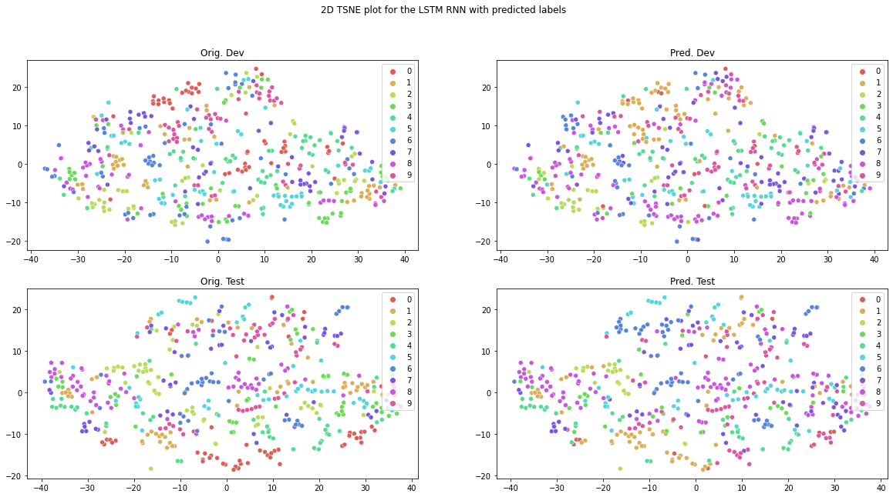

## Project overview

In this project, we developed an SDR system in a speaker-independent setting that can generalize to different speakers in real-world ASR systems. We performed a sequence classification task using two different neural networks, a simple RNN and a transformer model. Given a short audio clip as input, the respective model classifies the digit that was spoken. First, the given dataset was explored using MelSpectrograms and analyzed. Later, the raw data was fed to the neural network models to further improve inference results. We also explored two augmentation techniques SpecAugment and Wavaugment to emphasize on single-speaker generalization for global classification.  


## Structure

### Data

The data you will use for training, validation and testing is organized as follow:
```
/data/
    - speech_data: contains raw wav files
```

The folders contains file that have been first MFCC extracted and then downsampled. In the spectro-temporal representation of speech, a speech sample can be seen as a sequence of  $T$  spectral vectors as  $ X = x^{1}, x^{2}, .., x^{T}$. Each spectral vector  $ x^{t} \in R^{k}$  at time-step  $t$  is extracted from a short speech segment (~25 milliseconds) with the assumption that the signal is time-invariant in this small time window. Here,  $k$  is the number of frequency bands in the spectrogram and this is a parameter of the feature extraction pipeline. The representation is based on the Fourier transform to convert the temporal signal into the frequency domain. In this work, we fixed $k$ = 13.


### Models

#### Baseline

Before implementing the Baseline model we first downsampled the spectrogram. As $T$ varies in different speech samples, For our Baseline model we first preprocessed the data to create equal-sized sample representations where $ X' \in R^{Nxk}$; $N$ is the number of splits of $S$ across the time-axis. 
Mean-pooling was applied before rearranging the vector to its downsampled version. Then the samples were fed to the baseline linear model. There was a total of 2000 training files, 497 dev files, and 503 test files. 

We used a Linear SGD-based Classifier with hinge loss, which is an SVM model.

#### RNN 

We used a simple RNN architecture that uses a single LSTM layer and a linear layer followed by softmax-based output. In this case, each input wave sample was embedded to the size of 80. The model was trained for 30 epochs with early stopping (patience=5) to select the best model without exhausting resources.

#### Conformer 

The Conformer model introduced by \citet{conformer} is an amalgam of Convolution Neural networks and Transformers. This is based on the intuition that Transformer models can handle long-term dependencies well and Convolution models can handle local information well. Conformer was originally used in the case of speech recognition i.e. predicting the spoken text. 

The conformer block contains the self-attention module multi-headed self-attention module integrated with a relative sinusoidal positional encoding scheme; this module helps learn multiple long-term dependencies in a given sequence. The convolution unit has a point-wise convolution and a GLU and is succeeded by a 1-D depth-wise convolution layer. The Feedforward module has two linear transformations with a nonlinear activation function  between them. In the feed-forward module  Swish activation is used and further dropout is used for the purpose of regularisation. In our implementation, we have adapted this model for the case of Classification. 


## Statistical Experiments 

### Dimensionality Reduction

For dimensionality reduction, we used a t-SNE algorithm to reduce the dimensions of the spectrogram so that we can plot the data and see how our classification algorithms classify those points. We reduce the dimension of the spectrogram to 2 components of t-SNE which will act as the axes in our 2D plot. Figures below respectively show the t-SNE plots for the RNN and the Conformer model for both the dev and test set. As we can see in the plots, there don't seem to be definite clusters (based on the components generated by t-SNE) of each digit so it is a bit difficult to clearly see how accurate the classifications are from the plot. Nevertheless, we can still compare regions to get an idea of the classification accuracy or the decision boundaries.





When plotted for RNN, we can see that the classification seems to be better with fewer misclassifications as we don't see any one digit dominating the predictions. Still, there seems to be confusion between the digits 0 and 1 particularly in the dev set. In the case of the test set, the misclassification seems to be more among 3 and 8.


![](images/tsne_conf.png}


The plot is similar to that of the RNN with fewer misclassification errors. The Conformer model was much more accurate than the other two so both the original plot and the predicted model for Conformer seem similar with fewer errors. As we've discussed before in the Confusion matrix section, we can see the confusion between 9 and 1 and 8 and 6 in the plots for the dev and test set above.


### Bootstrap Evaluation

To measure the statistical significance of our predictions and their accuracy on the test set the bootstrap approach was used. In Bootstrap we randomly sample 'n' examples from the test set and repeatedly evaluate our model on this bootstrapped set. 
% We then compare it to our existing improvement in accuracy. We repeat this process thousands of times to get a p-value based on the bootstrap test set evaluations. If the p-value is < 0.05, we can be 95% sure that the improvement in accuracy due to our neural models is not due to chance. We calculated the average accuracy for 2500 iterations for the Conformer model. While this number of iterations is not enough to concretely say that the improvement is statistically significant, the standard error is zero and the average accuracy is around 80% (close to the test accuracy of the Conformer model) which suggests that the improvement might
be statistically significant. 

## Experiment on Single-speaker Data

In this section, we discuss the results from training the conformer model using only the data of one speaker. Upon training the Conformer model on one of the speakers (George), the test accuracy dropped to 26% as the training set only had 500 examples to train from and the evaluations were made on the original dev and test set. This is expected as the model is trained on a very small dataset with fewer feature variations to learn from; thus the highly flexible creates a lot of bias and consecutively performs poorly on test sets. To tackle this issue and bring about more variation in the train dataset without introducing more speakers, we explored two different augmentation strategies. 

### SpecAugment and WavAugment 

The first Data Augmentation technique used was SpecAugment introduced by \citet{spec} as an approach to data augmentation for Audio. This approach augments the mel spectrogram directly. This is applied to George's audio data to generate additional 500 examples totalling 1000 training examples. We trained the conformer model with this augmented data using the same methodology mentioned as before.  
Secondly, We also used WavAugment introduced by \citet{wav} which directly augments the raw waveform. Thus, in this case, we can use the raw waveforms without extracting the Mel-frequency cepstral coefficients from them. The total number of training data and training process is the same as that of SpecAugment. The results are summarized  in table \ref{tab:accents}.

### Contrastive Loss Learning 

In our case, SpecAugment was found to have performed better than WavAugment, hence contrastive loss learning is implemented with this augmentation technique. In a supervised learning setting, the contrastive loss is added to the cross-entropy loss and then backpropagated. Although \citet{wav} showed that contrastive learning improves the WavAugment technique's results, we did not find the same case for the SpecAugment technique. The previous model with simple cross-entropy loss performed better by 19.74% than the one combined with contrastive loss. 


## Results 
Test accuracy for different models:

|Whole Dataset              |Accuracy|
|---------------------------|-------:|
|SVM                        |     36%|
|RNN                        |  62.62%|
|Conformer                  |  80.52%|
|---------------------------|-------:|
|Single-speaker Dataset     |        |
|---------------------------|-------:|
|Conformer                  |  27.63%|
|SpecAugment+Conformer      |  42.35%|
|WavAugment+Conformer       |  32.41%| 
|SpecAugment+Conformer+CL   |  33.99%|

